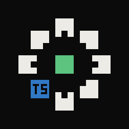

# panoptife-ts

**The TypeScript, Svelte and React frontend for [Panopticode][core]: turns a SvelteKit, React or Next.js app into code graph facts.**

[](https://github.com/panoptiorg/panoptife-ts/actions/workflows/ci.yml)
[](LICENSE)

`pc-fe-ts` reads a SvelteKit, React (including Next.js) or plain TypeScript
repository and writes CGF, the input of the [panopticode][core] taint engine.
It covers the browser side of a system and the routes a Node meta-framework
serves: where untrusted input enters the app, how it moves through the app's
own code, and which GraphQL fields and HTTP routes it is sent to. Each GraphQL
call is named after its schema field and each HTTP call after its method and
path, and the [Go frontend][go] names the matching resolver or route the same
way, so the engine can follow a value from a page into a Go backend. Vue and
Angular templates are not read.

**Overview, diagrams and live examples: [panopti.org](https://panopti.org)**

## Quickstart

You need Node.js 22 or later. `fixtures/webapp` is a small SvelteKit app with a
search page. Its GraphQL client stands in for an in-house gateway, so the
adapter is named explicitly:

```bash
npm ci && npm run build
./bin/pc-fe-ts build fixtures/webapp --adapter bff-gateway --out out/webapp
```

To get findings, run the [engine][core] over this output together with the Go
services the app calls. The engine repository ships those pre-extracted. With
the engine built in a sibling checkout:

```console
$ ../panopticode/core/target/debug/panopticode taint --catalog ../panopticode/catalog.example.toml \
    --cgf out/webapp --cgf ../panopticode/testdata/cgf/federation --cgf ../panopticode/testdata/cgf/backend \
    > chains.json 2> taint.log
$ jq -r '.[] | select(.source_repo == "webapp") | [.sink_class, .source_fn,
    (.route.hops | map(select(.kind == "boundary").callee) | join(" -> "))] | @tsv' chains.json | column -t -s $'\t'
sqli           src/routes/search/+page.server.ts:load                      graphql:Query.searchByToken -> pb.Account/GetAccount
open_redirect  src/routes/search/+page.svelte:$script
sqli           src/routes/search/+page.svelte:$script                      graphql:Query.searchByToken -> pb.Account/GetAccount
xss            src/routes/search/+page.svelte:$script
sqli           src/service/gateway/endpoints/search/index.ts:searchClient  graphql:Query.searchByToken -> pb.Account/GetAccount
```

The `sqli` findings start in the app, cross a GraphQL field into a Go resolver
and then a gRPC call, and end at a SQL query. The `xss` and `open_redirect`
findings stay inside the app.

## Documentation

| | |
|---|---|
| [CLI](docs/cli.md) | every flag, schema discovery, adapter selection, exit codes |
| [How it works](docs/how-it-works.md) | Svelte lowering, JSX and React, call resolution, endpoints and routes, the GraphQL join, HTTP client calls, known gaps |
| [Adapters](adapters/README.md) | the shipped adapters, and how to write one for your GraphQL client |
| [fixtures/webapp](https://github.com/panoptiorg/panoptife-ts/tree/main/fixtures/webapp) | the example app used above |
| [fixtures/reactapp](https://github.com/panoptiorg/panoptife-ts/tree/main/fixtures/reactapp), [fixtures/nextapp](https://github.com/panoptiorg/panoptife-ts/tree/main/fixtures/nextapp) | a React single-page app and a Next.js app |

## Contributions 
Are welcome; see
[CONTRIBUTING.md](https://github.com/panoptiorg/panoptife-ts/blob/main/CONTRIBUTING.md). Licensed under [Apache-2.0](LICENSE).

## Part of Panopticode

| | |
|---|---|
| [panopticode][core] | the engine: joins CGF from many repositories and finds taint flows |
| [panoptife-go][go] | Go frontend |
| **panoptife-ts** | TypeScript, Svelte and React frontend (this repository) |

[core]: https://github.com/panoptiorg/panopticode
[go]: https://github.com/panoptiorg/panoptife-go
